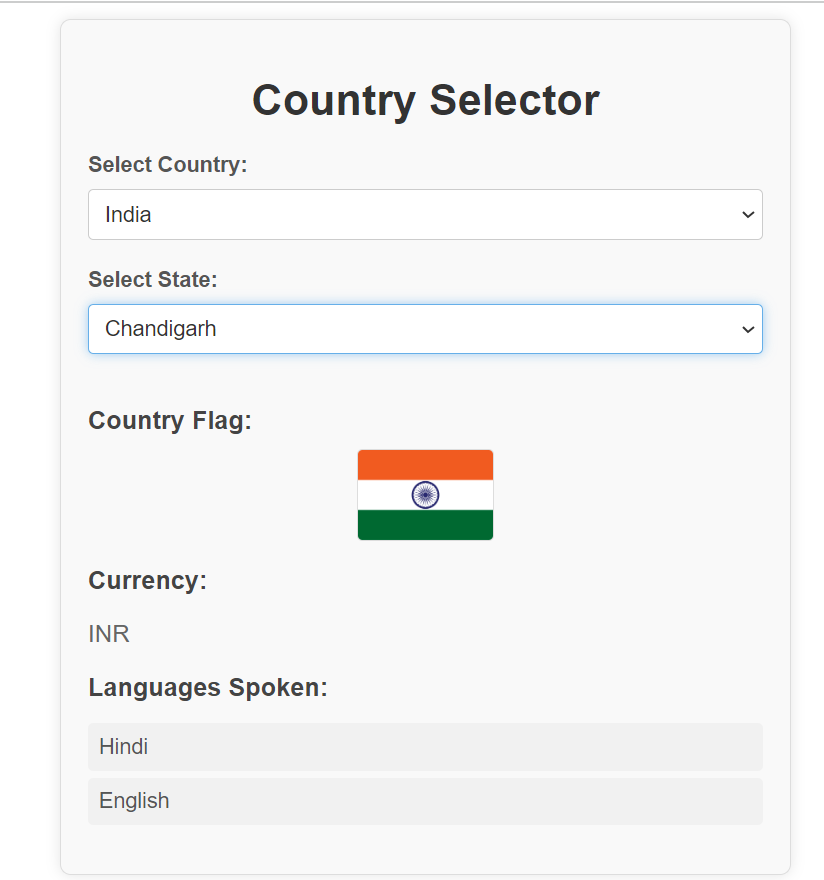

## Country Data Package ##
A comprehensive npm package that provides detailed information about countries, including country names, flags, states, currencies, and languages.

## Table of Contents
Installation
Usage
Data Structure
Methods
Examples
Contributing
License

## Installation
To install this package, run the following command:
npm i @omprakashkumar/country-data-package

## Data Structure
This package includes the following data structures:

Countries: A list of countries with their names and codes.
States: A list of states/provinces for each country.
Currencies:A list of currencies for each country.
Languages:A list of official languages spoken in each country.
Flags: The flag of each country represented as flag.

## Methods
getCountries()
Returns a list of all countries.

const countries = countryData.getCountries();

getStatesByCountry(countryCode)
Returns a list of states/provinces for a given country code.
const states = countryData.getStatesByCountry('IN');

getCurrencyByCountry(countryCode)
Returns the currency of a given country code.
const currency = countryData.getCurrencyByCountry('IN');

getLanguagesByCountry(countryCode)
Returns a list of official languages spoken in a given country code.
const languages = countryData.getLanguagesByCountry('IN');

getFlagByCountry(countryCode)
Returns the flag of a given country code as flag.
const flag = countryData.getFlagByCountry('IN');

### See the example of how you can implement this in your component.
## ReactJS / TypeScript 

---------------------   App.jsx   ---------------------
import css from './App.css'
import React, { useState } from 'react';
import {
  getCountries,
  getStatesByCountry,
  getCurrencyByCountry,
  getLanguagesByCountry,
  getFlagByCountry,
} from '@omprakashkumar/country-data-package';

function App() {
  const [selectedCountry, setSelectedCountry] = useState('');
  const [states, setStates] = useState([]);
  const [flag, setFlag] = useState('');
  const [currency, setCurrency] = useState('');
  const [languages, setLanguages] = useState([]);

  const handleCountryChange = (e) => {
    const country = e.target.value;
    setSelectedCountry(country);
    setStates(getStatesByCountry(country));
    setFlag(getFlagByCountry(country));
    setCurrency(getCurrencyByCountry(country));
    setLanguages(getLanguagesByCountry(country));
  };

  return (
    

      <h1>Country Selector</h1>

      <label>Select Country:</label>
      <select value={selectedCountry} onChange={handleCountryChange}>
        <option value="">--Select a Country--</option>
        {getCountries().map((country) => (
          <option key={country.code} value={country.code}>
            {country.name}
          </option>
        ))}
      </select>

      {selectedCountry && states.length > 0 && (
        <>
          <label>Select State:</label>
          <select>
            <option value="">--Select a State--</option>
            {states.map((state) => (
              <option key={state.code} value={state.code}>
                {state.name}
              </option>
            ))}
          </select>
        </>
      )}

      {flag && (
        

          <h3>Country Flag:</h3>
          
        

      )}

      {currency && (
        

          <h3>Currency:</h3>
          
{currency}

        

      )}

      {languages.length > 0 && (
        

          <h3>Languages Spoken:</h3>
          <ul>
            {languages.map((language, index) => (
              <li key={index}>{language}</li>
            ))}
          </ul>
        

      )}
    

  );
}

export default App;

------------------------------ App.css ----------------------
.App {
  font-family: Arial, sans-serif;
  max-width: 500px;
  margin: 50px auto;
  padding: 20px;
  border: 1px solid #ddd;
  border-radius: 8px;
  background-color: #f9f9f9;
  box-shadow: 0 0 10px rgba(0, 0, 0, 0.1);
}

h1 {
  text-align: center;
  color: #333;
  margin-bottom: 20px;
}

label {
  display: block;
  margin-bottom: 8px;
  font-weight: bold;
  color: #555;
}

select {
  width: 100%;
  padding: 8px;
  margin-bottom: 20px;
  border: 1px solid #ccc;
  border-radius: 4px;
  background-color: #fff;
  font-size: 16px;
  color: #333;
}

select:focus {
  border-color: #66afe9;
  outline: none;
  box-shadow: 0 0 8px rgba(102, 175, 233, 0.6);
}

h3 {
  color: #444;
  margin-bottom: 10px;
}

img {
  display: block;
  margin: 10px auto;
  border: 1px solid #ddd;
  border-radius: 4px;
}

p {
  font-size: 18px;
  color: #666;
}

ul {
  list-style-type: none;
  padding-left: 0;
}

ul li {
  background-color: #f1f1f1;
  margin-bottom: 5px;
  padding: 8px;
  border-radius: 4px;
  font-size: 16px;
  color: #555;
}

ul li:hover {
  background-color: #e9e9e9;
}

------------------------------------------------------------ 
### Output 

